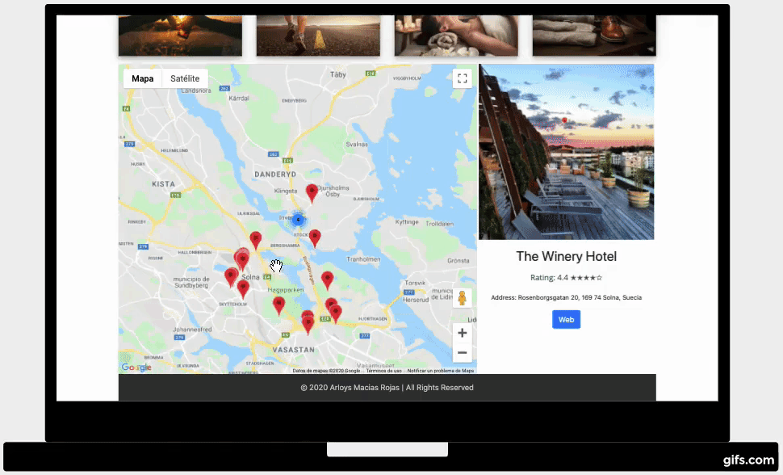

# Near
This is my 2nd milestone project with Code Institute and their Full Stack Web Developer course.

## Demo

## Summary 

### Project purpose: Presentation of interacitve data

In this project, you'll build an interactive front-end site. The site should respond to the users actions, allowing users to actively engage with data, alter the way the site displays the information to achieve their preferred goals.

Value provided:
Users are able to interact with the site in their particular way, to achieve their personal goals and derive answers to their specific questions.
The site owner advances their own goals by providing this functionality, potentially by being a regular user themselves.

### Main Technologies

* Required: HTML, CSS, JavaScript

* Optional: jQuery or any other JavaScript libraries, external APIs.

### Near

The other day I was on my bike and I wanted to find a place to eat. I had to use my phone but didn't know where I wanted to go. I opened Google Maps and either had to know the name and write it or go through the many options provided. This takes time, requires many clicks, which can be frustrating and is not particularly safe to do while moving. So I decided that I would make my project an interactive map that is easy and fast to use. 

#### GoogleMaps API
This project uses [Maps JavaScript API](https://developers.google.com/maps/documentation/javascript/tutorial), which lets you customize maps with your own content and imagery for display on web pages and mobile devices, and [Places API](https://developers.google.com/places/web-service/intro), which is a service that returns information about places using HTTP requests. These are both are managed from the Google Cloud Platform Console (also referred to as the Cloud Console). 

##### How to use the APIs:

To [use](https://developers.google.com/maps/documentation/javascript/tutorial) the APIs an API_key is required and this key is loaded using a script tag, which can be added inline in your HTML file or dynamically using a separate JavaScript file. In this project the API_key was loaded inline at the bottom of page just above "My Script". 

`
`

The Google API has a free tier. Once the service is connected you can limit the calls it can make to the limit of the free tier so it can never go over and start charging you. Project limit:
* Daily limit: 24000 requests/day 

## UX

### User Stories:
* As a user I want an easier and faster way to find the nearest basic places

* As a user I want a user friendly platform 

### Design and Colors

#### Wireframes

For the design of the project I wanted to have a map as the main feature but I also wanted to include images and icons representing the places the user could choose from. Therefore the map is the largest part but the choosable images are at the top to be easily accessable.

##### Final wireframes:

[Mobile view](https://github.com/ArloysMacias/Near/blob/master/assets/images/moqups/moqups1.png)

[Desktop and tablet view](https://github.com/ArloysMacias/Near/blob/master/assets/images/moqups/moqups2.png)

#### Colors

The default map is very colorful and I wanted to keep the rest of the page clean with a white background. Originally, I had a white toned background image of plates but it looked too messy and I switched to the all white background. I chose a warm tone on the images which are appealing and easy on the eyes as well as fitting well with the map. The color of the icons are white with a dark transparent background to fit with both the satellite and road map view.

#### Fonts

For the font for Heading1`<h1>` and the paragraphs`
` I used Open Sans, from Google Fonts. This font works well with the design as it is modern and simple. > Open Sans was designed with an upright stress, open forms and a neutral, yet friendly appearance. It was optimized for print, web, and mobile interfaces, and has excellent legibility characteristics in its letterforms. - [[Google Fonts, 2020]](https://fonts.google.com/specimen/Open+Sans).

## Features

### Existing Features

* Header: Allows user to know the name of the project as well as understanding what it is.

* Image cards: Allows user to see different categories to choose from.

* Icons: Allows user to specify their preferred choice of location and show it on the map.

* Map: Allows user to visualize their position and the nearest chosen places. 

* Markers: Allows the user to fetch the information of one specific place and show it in a panel.

* Panel: Allows user to visualize specific information sent by the marker (picture of the place ([if available](https://developers.google.com/places/web-service/photos?hl=es)), name, rating, address and website).

* Footer: Allows the user to see copyright, date of project completion and author. 

### Features Left to Implement

Google Maps API has many more different types of places than the 16 that are displayed in this project. A future feature would be to give the user the option to customize the displayed basic 16 icons with the locations they prefer to have presented.

## Technologies

* [HTML5](https://html.spec.whatwg.org/multipage/)
    * A markup language that it is used for structuring and presenting content. 
* [CSS](https://www.w3.org/Style/CSS/)
    * The language for describing the presentation of Web pages. The project uses it for including colors, layout, and fonts.
* JavaScript
    * Used to make web development easier and more attractive.
* [Boostrap](https://getbootstrap.com/)
    * A front-end helper with a free collection of tools that is used to design and customize a responsive layout to the project.
* [JQuery](https://jquery.com/)
    * The project uses JQuery to simplify DOM manipulation.
* [IntelliJ IDEA](https://www.jetbrains.com/es-es/idea/)
    * An integrated development environment (IDE) written in Java. It it is used for developing and coding. 
* [Git](https://git-scm.com/doc)
    * Used for tracking changes in the code during software development.
* [GitHub](https://github.com/) 
    * A Git repository hosting service which provides a Web-based graphical interface and is also used to trigger deployments.
* [Font Awesome](https://fontawesome.com/) 
    * The project uses it to get vector icons and social logos.
* [Google Fonts](https://fonts.google.com/) 
    * The project uses it to get elegant fonts without compromising users’ privacy or security.
* [Moqups](https://moqups.com)
    * A streamlined web app that was used to create the mockups.
    
## Testing

This site was tested with the inspection function of Chrome and Firefox and the featured mobile view that they provide (iphone 6, 7, 8 plus and ipad). No issues were detected during the testing. Neither were any issues found when tests were performed in devices with high contrast.

I used [W3C Validator](https://validator.w3.org/) to check the markup validity of Web documents in HTML and CSS. Highlighted errors:

### CSS Validation
Before:

After:

### HTML Validation
Before:

After:

### JavaScrip

I used [Esprima](https://esprima.org/demo/validate.html) Syntax Validator to check map.js and mapsSpec.js, the code was syntactically valid.

map.js

mapsSpec.js:

### Functional tests

|   Scenario  |        Test      |    Actual Result  |  Pass/Fail  |     Comments     |
| ------------|:----------------:| :----------------:| :----------:| :---------------:|
|User opens the project| Navigator supports geolocation | Navigator has geolocation, asks for permission to access your location | Pass | This was tested in India and Sweden with different devices and positions
|       | Navigator doesn't support geolocation | Alert showing "Your browser does not support the geolocation API." | Pass | Geolocation is most accurate for devices with GPS, like smartphone. [Browsers supported](https://www.w3schools.com/html/html5_geolocation.asp) 
|    | User denies permission to access his position | Alert shows "Access to the user's position has not been allowed." | Pass | 
|    | Navigator supports geolocation but the position is unavailable | Alert shows "Your position information could not be accessed." | Pass |
|    | Navigator supports geolocation, user allows access to his position but the it takes too long to access his position | Alert shows "The service has taken too long to respond." | Pass | This was tested in Cuba where internet is very slow. 
|    | Navigator supports geolocation, user allows access to his position, the navigator finds his position but the map doesn't show up | Alert shows "Unknown error." | Pass | This was added to inform the user that something went wrong and not keep him waiting
| User picks a place (icon) nearby | The map shows places in a 5000 m radius | The map shows position of places nearby | Pass |
|    | The map doesn't show places nearby if non exist | The map shows user position but no places nearby | Pass | To test this in Stockholm the radius was reduced to 40 m 
| User picks (clicks on marker) one of the places nearby | The panel shows information | Photo, Name, Rating, Address is displayed about the place | Pass | 
| User decides to go to a website | Test links provided by the API | The links provided by the api are correct and the user is redirected to the website of the site he chose | Pass

### Unit tests
For unit tests the [Jasmine](https://jasmine.github.io/2.5/introduction) unit testing framework was used

* For the 1st test I Mock out Google Maps Places API following with Jasmine Spies created by [Kevin Wilson](https://kwilson.io/blog/mock-out-google-maps-geocoder-with-jasmine-spies/)
    

* For the second test try to verify that the map was created correctly and this mainly depends on whether or not the browser used supports geolocation, so just showing an alert that the browser supports geolocation would be sufficient.
  To do this I instantiated the constructor and called the function initMapa and `spyOn(window, 'alert');`
    
    
## Deployment

The project was created with IntelliJ and the site is hosted by GitHub. Different branches were used, each one with various commits, named depending on their long-term purpose and changed characteristic respectively. Several pull requests were created once the branch's purpose was fulfilled. It was used the master branch which allows every change, commit and push to show immediately in real time to users.

### Allowing GitHub to publish from your site

* Find the [repository](https://github.com/ArloysMacias/Near) on GitHub.

* Under the repository name click `Settings` 

* Under ***GitHub Pages*** section find and select `master branch` in the drop-down menu

* Click `Save

* A green information should appear that says "Your site is published at [https://user-name.github.io/Project-Name/](https://arloysmacias.github.io/Near/)"

### Cloning your repository to create local copy

* Select the [Repository](https://github.com/ArloysMacias/Near)

* Click on the 'Clone or Download' button

* Copy the URL provided

* Open terminal (Mac) / Open Git Bash (Windows) 

* Find the directory you want to clone the repository to

* Type `git clone` and paste the URL, press Enter

* Your local clone has be created

## Credits

Thanks to my mentor who supported me and came with good ideas and thanks to my wife who put up with me during this time.